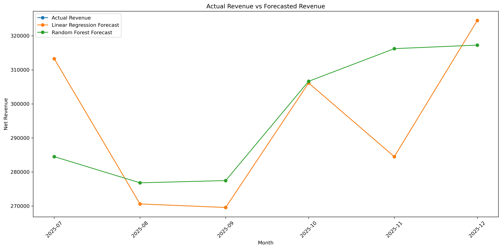
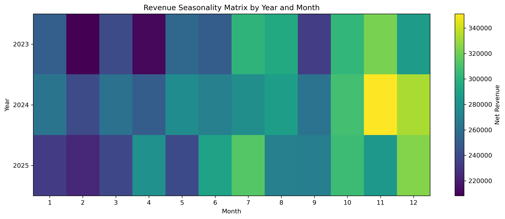

# Sales Forecasting and Revenue Trend Analysis

This project demonstrates how Python can be used to analyze historical sales transactions, identify revenue trends, create forecasting features, compare machine learning models, and generate a six month revenue forecast.

The project uses a simulated business sales dataset with 8,574 transaction level records across 36 months. The workflow creates monthly revenue summaries, category and channel performance tables, customer segment analysis, seasonality views, forecast accuracy metrics, and multiple visual outputs that can support business planning and dashboard development.

---

## Tools Used


---

## Skills Demonstrated


---

## Project Preview

### Monthly Net Revenue Trend with Moving Averages


### Actual Revenue Compared to Forecasted Revenue



### Six Month Future Revenue Forecast


### Revenue Seasonality Matrix



---

## View the Python Work

| File | Description |
|---|---|
| [Jupyter Notebook](notebooks/02_sales_forecasting.ipynb) | Full notebook with data generation, analysis, visualizations, modeling, and forecasting |
| `scripts/` | Script folder reserved for the clean Python script version of this project |
| `data/raw/sales_transactions_8574_rows.csv` | Raw simulated sales transaction dataset |
| `data/cleaned/` | Cleaned summary tables and forecasting outputs |
| `images/` | Saved visual outputs for GitHub and portfolio preview |

---

## Business Problem

Businesses often need to understand revenue trends, seasonal patterns, product performance, channel performance, and future sales expectations. However, raw sales transactions alone do not clearly show what is happening over time or what may happen next.

This project answers the question:

> How can Python be used to turn transaction level sales data into trend analysis, forecasting insights, and dashboard ready business outputs?

---

## Dataset

The raw dataset contains 8,574 simulated sales transactions from January 2023 through December 2025.

The dataset includes:

* Transaction ID
* Order date
* Region
* Product category
* Sales channel
* Customer segment
* Units sold
* Unit price
* Discount rate
* Gross revenue
* Discount amount
* Net revenue

The data was designed to include realistic business patterns such as different product categories, multiple sales channels, customer segments, seasonal revenue lift, and monthly revenue variation.

---

## Workflow

The notebook follows this process:

1. Import Python and data science libraries
2. Create an 8,574 row transaction level sales dataset
3. Save the raw sales transaction file
4. Load and prepare the dataset
5. Create monthly revenue summaries
6. Engineer time series features
7. Create moving average features
8. Calculate month over month revenue growth
9. Create lag features for forecasting
10. Analyze revenue by category, channel, region, and customer segment
11. Visualize monthly revenue trends
12. Visualize moving averages
13. Visualize month over month growth
14. Visualize customer and sales channel performance
15. Build forecasting models with scikit learn
16. Compare Linear Regression and Random Forest Regressor
17. Calculate model accuracy metrics
18. Create a six month future revenue forecast
19. Export cleaned data and model outputs
20. Save visual outputs for reporting and portfolio use

---

## Python Code Preview

### Creating Monthly Sales Features

```python
monthly_sales["month_number"] = np.arange(1, len(monthly_sales) + 1)
monthly_sales["year"] = monthly_sales["order_month"].dt.year
monthly_sales["month"] = monthly_sales["order_month"].dt.month
monthly_sales["quarter"] = monthly_sales["order_month"].dt.quarter

monthly_sales["revenue_3_month_moving_avg"] = (
    monthly_sales["total_net_revenue"]
    .rolling(window=3)
    .mean()
)

monthly_sales["revenue_6_month_moving_avg"] = (
    monthly_sales["total_net_revenue"]
    .rolling(window=6)
    .mean()
)
```

### Creating Forecasting Lag Features

```python
monthly_sales["revenue_lag_1"] = monthly_sales["total_net_revenue"].shift(1)
monthly_sales["revenue_lag_2"] = monthly_sales["total_net_revenue"].shift(2)
monthly_sales["revenue_lag_3"] = monthly_sales["total_net_revenue"].shift(3)
```

### Training Forecasting Models

```python
linear_model = LinearRegression()

random_forest_model = RandomForestRegressor(
    n_estimators=300,
    random_state=42,
    max_depth=6
)

linear_model.fit(X_train, y_train)
random_forest_model.fit(X_train, y_train)
```

### Creating a Future Forecast

```python
forecast_value = random_forest_model.predict(future_features)[0]

future_forecast_rows.append({
    "forecast_month": future_month,
    "forecasted_net_revenue": round(forecast_value, 2)
})
```

---

## Key Findings

The dataset contains 8,574 sales transactions across 36 months of business activity.

Total revenue was analyzed by month, product category, sales channel, region, and customer segment. The monthly revenue data showed recurring seasonal patterns, with stronger revenue performance during several summer and fourth quarter months.

The highest revenue product category was Technology, generating approximately $2.77 million in net revenue. Software and Office Supplies followed with approximately $1.91 million and $1.89 million in net revenue.

Online was the strongest sales channel, generating approximately $4.12 million in net revenue. Retail, Partner, and Direct Sales followed behind.

The South region produced the highest net revenue at approximately $3.13 million, followed by the West at approximately $2.74 million.

Small Business was the highest revenue customer segment, generating approximately $3.50 million in net revenue. Mid Market was second with approximately $2.94 million.

The six month future forecast estimated revenue between approximately $256,843 and $268,734 per month for January 2026 through June 2026.

---

## Sample Results

### Product Category Sales Summary

| Product Category | Transactions | Units Sold | Net Revenue | Average Order Value |
|---|---:|---:|---:|---:|
| Technology | 2,437 | 14,622 | $2,766,449.46 | $1,135.19 |
| Software | 1,638 | 9,958 | $1,906,799.98 | $1,164.10 |
| Office Supplies | 1,654 | 9,785 | $1,888,444.75 | $1,141.74 |
| Furniture | 1,551 | 9,233 | $1,773,118.14 | $1,143.21 |
| Services | 1,294 | 7,777 | $1,490,402.54 | $1,151.78 |

### Sales Channel Summary

| Sales Channel | Transactions | Units Sold | Net Revenue | Average Order Value |
|---|---:|---:|---:|---:|
| Online | 3,586 | 21,510 | $4,122,438.06 | $1,149.59 |
| Retail | 2,012 | 12,195 | $2,322,503.65 | $1,154.33 |
| Partner | 1,713 | 10,338 | $1,974,016.93 | $1,152.37 |
| Direct Sales | 1,263 | 7,332 | $1,406,256.23 | $1,113.43 |

### Region Sales Summary

| Region | Transactions | Units Sold | Net Revenue | Average Order Value |
|---|---:|---:|---:|---:|
| South | 2,722 | 16,190 | $3,127,542.49 | $1,148.99 |
| West | 2,365 | 14,430 | $2,741,822.73 | $1,159.33 |
| Midwest | 1,792 | 10,675 | $2,029,870.71 | $1,132.74 |
| Northeast | 1,695 | 10,080 | $1,925,978.94 | $1,136.27 |

### Customer Segment Summary

| Customer Segment | Transactions | Units Sold | Net Revenue | Average Order Value |
|---|---:|---:|---:|---:|
| Small Business | 3,021 | 18,303 | $3,498,350.02 | $1,158.01 |
| Mid Market | 2,603 | 15,306 | $2,938,932.91 | $1,129.06 |
| Enterprise | 1,660 | 10,036 | $1,893,151.32 | $1,140.45 |
| Consumer | 1,290 | 7,730 | $1,494,780.62 | $1,158.74 |

### Six Month Future Forecast

| Forecast Month | Forecasted Net Revenue |
|---|---:|
| 2026 01 | $256,842.96 |
| 2026 02 | $261,619.85 |
| 2026 03 | $259,508.59 |
| 2026 04 | $262,876.08 |
| 2026 05 | $263,914.52 |
| 2026 06 | $268,734.16 |

### Forecast Accuracy Summary

| Model | MAE | RMSE | R2 Score |
|---|---:|---:|---:|
| Linear Regression | $0.00 | $0.00 | 1.0000 |
| Random Forest Regressor | $13,716.88 | $18,196.31 | 0.2583 |

Note: The Linear Regression model perfectly matched the test period in this simulated dataset because the engineered features strongly explained the target pattern. The Random Forest model is included to demonstrate model comparison, error measurement, and forecasting workflow design.

---

## Visual Outputs Created

This project creates several visual outputs:

| Visual | Purpose |
|---|---|
| Monthly revenue trend with moving averages | Shows revenue direction and smoothing over time |
| Revenue by product category | Identifies the strongest product areas |
| Revenue by sales channel | Shows which channels drive the most revenue |
| Revenue by region | Compares geographic performance |
| Revenue by customer segment | Shows which customer groups contribute the most revenue |
| Monthly transaction volume | Tracks sales activity over time |
| Month over month revenue growth | Shows revenue volatility and growth patterns |
| Revenue seasonality matrix | Highlights year and month seasonal patterns |
| Actual vs forecasted revenue | Compares model predictions to actual results |
| Six month future forecast | Shows expected future revenue trend |

---

## Files

| File or Folder | Description |
|---|---|
| `notebooks/02_sales_forecasting.ipynb` | Main Jupyter Notebook with analysis, visuals, models, and forecast |
| `data/raw/sales_transactions_8574_rows.csv` | Raw transaction level sales dataset |
| `data/cleaned/monthly_sales_summary.csv` | Monthly revenue summary with time series features |
| `data/cleaned/category_sales_summary.csv` | Product category level performance summary |
| `data/cleaned/channel_sales_summary.csv` | Sales channel level performance summary |
| `data/cleaned/region_sales_summary.csv` | Region level performance summary |
| `data/cleaned/segment_sales_summary.csv` | Customer segment level performance summary |
| `data/cleaned/forecast_model_comparison.csv` | Actual revenue compared to model predictions |
| `data/cleaned/six_month_future_forecast.csv` | Future forecast output |
| `data/cleaned/forecast_accuracy_summary.csv` | Model accuracy metrics |
| `data/cleaned/revenue_seasonality_matrix.csv` | Seasonality table by year and month |
| `images/` | Saved project visuals |

---

## Business Value

This project shows how Python can help businesses move beyond basic historical reporting and into forward looking analytics.

A workflow like this can help a business:

* Understand which products, regions, channels, and customer segments drive the most revenue
* Identify monthly and seasonal revenue patterns
* Track growth and revenue volatility
* Compare forecasting models
* Estimate future revenue for planning
* Create dashboard ready datasets for Power BI or QuickSight
* Support staffing, inventory, sales, and budget planning
* Reduce manual spreadsheet based forecasting work

The project demonstrates a full analytics process from raw transaction data to executive ready insights, model outputs, forecast tables, and visual results.

---

## Portfolio Note

This project is part of my Python Business Analytics Portfolio. It supports my broader portfolio work in Power BI, SQL, PostgreSQL, dashboard development, and business intelligence reporting.

[Back to Main Python Portfolio](../README.md)
