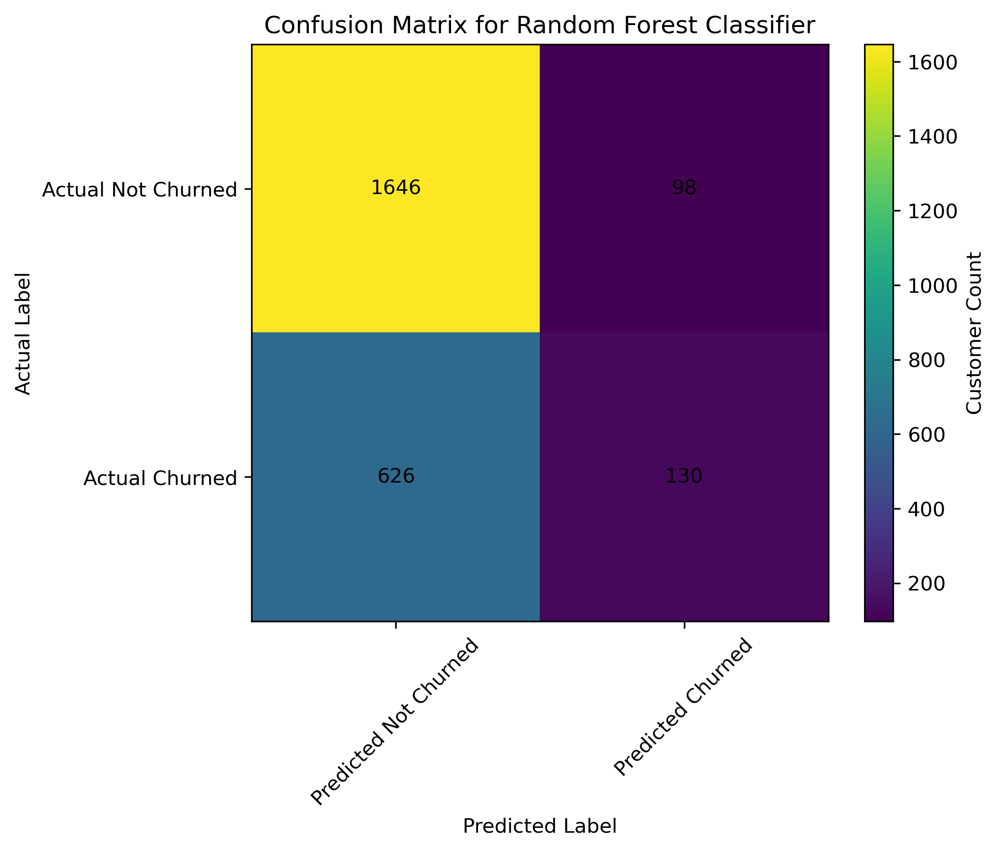
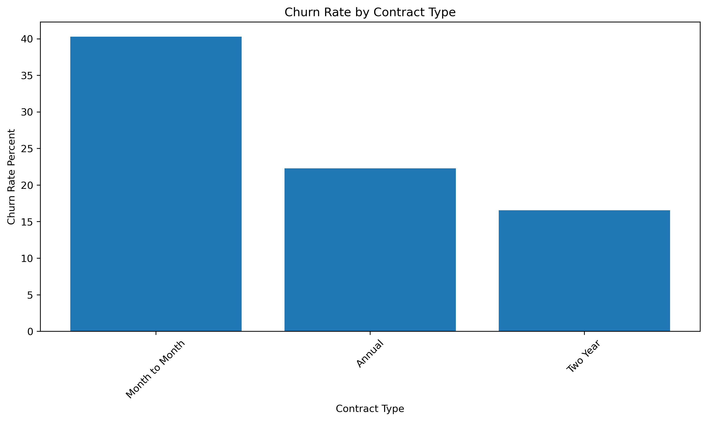
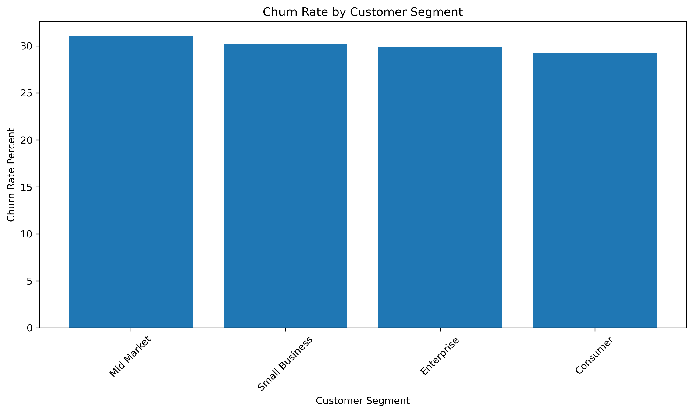
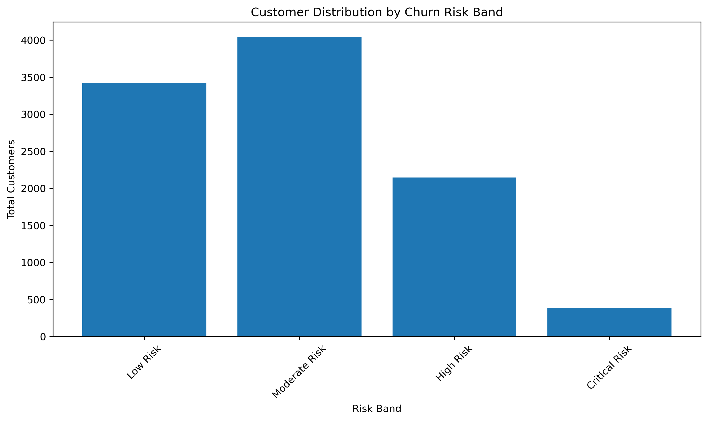

# Customer Churn Prediction and Retention Risk Analysis

This project demonstrates how Python and machine learning can be used to predict customer churn, identify high risk customer groups, estimate revenue at risk, and create dashboard ready retention outputs for business decision making.

The project uses a simulated customer dataset with 10,000 customer records. The workflow includes churn risk feature engineering, customer segmentation, retention priority scoring, revenue at risk analysis, machine learning classification, model evaluation, feature importance analysis, and saved visual outputs.

---

## Tools Used


---

## Skills Demonstrated


---

## Project Preview

### Top Churn Prediction Drivers


### Churn Model Confusion Matrix



### Churn Rate by Contract Type



### Churn Rate by Customer Segment



### Revenue at Risk by Retention Priority


### Customer Distribution by Risk Band



---

## View the Python Work

| File | Description |
|---|---|
| [Jupyter Notebook](notebooks/03_customer_churn_prediction.ipynb) | Full notebook with data generation, churn analysis, risk scoring, machine learning, visuals, and outputs |
| `data/raw/customer_churn_10000_rows.csv` | Raw simulated customer churn dataset |
| `data/cleaned/` | Cleaned scored dataset, summary tables, model outputs, and risk analysis files |
| `images/` | Saved visual outputs for GitHub and portfolio preview |

---

## Business Problem

Customer churn can reduce recurring revenue, increase acquisition costs, and make growth harder to forecast. Businesses need to know which customers are most likely to leave, why they may leave, and which accounts should receive retention outreach first.

This project answers the question:

> How can Python and machine learning help identify churn risk, prioritize retention efforts, and estimate revenue at risk?

---

## Dataset

The raw dataset contains 10,000 simulated customer records.

The dataset includes:

* Customer ID
* Customer segment
* Contract type
* Region
* Tenure in months
* Monthly revenue
* Support tickets in the last 90 days
* Late payments in the last 12 months
* Product usage score
* Satisfaction score
* Last login days ago
* Discount percent
* Churn probability
* Churned status
* Annual revenue

The data was designed to reflect realistic churn drivers such as contract type, low product usage, low satisfaction, recent inactivity, support burden, payment issues, and customer tenure.

---

## Workflow

The notebook follows this process:

1. Import Python and data science libraries
2. Create a 10,000 row customer churn dataset
3. Save the raw customer file
4. Analyze churn by customer segment
5. Analyze churn by contract type
6. Engineer customer lifetime value
7. Estimate annual revenue at risk
8. Create behavioral risk flags
9. Create churn risk bands
10. Assign retention priority levels
11. Build churn summary tables
12. Train machine learning classification models
13. Compare Logistic Regression, Random Forest, and Gradient Boosting
14. Evaluate models using accuracy, precision, recall, F1 score, and ROC AUC
15. Create a confusion matrix
16. Identify top churn prediction drivers
17. Save dashboard ready CSV outputs
18. Save chart images for reporting and portfolio use

---

## Python Code Preview

### Creating Customer Lifetime Value

```python
df["customer_lifetime_value"] = (
    df["monthly_revenue"] * df["tenure_months"]
).round(2)
```

### Creating Revenue at Risk

```python
df["estimated_annual_revenue_at_risk"] = np.where(
    df["churned"] == 1,
    df["annual_revenue"],
    0
).round(2)
```

### Creating Risk Flags

```python
df["usage_risk_flag"] = np.where(df["product_usage_score"] < 45, 1, 0)
df["satisfaction_risk_flag"] = np.where(df["satisfaction_score"] < 6, 1, 0)
df["login_risk_flag"] = np.where(df["last_login_days_ago"] > 45, 1, 0)
df["support_risk_flag"] = np.where(df["support_tickets_last_90_days"] >= 4, 1, 0)
df["payment_risk_flag"] = np.where(df["late_payments_last_12_months"] >= 3, 1, 0)

df["total_risk_flags"] = (
    df["usage_risk_flag"]
    + df["satisfaction_risk_flag"]
    + df["login_risk_flag"]
    + df["support_risk_flag"]
    + df["payment_risk_flag"]
)
```

### Creating Churn Risk Bands

```python
df["risk_band"] = pd.cut(
    df["churn_probability"],
    bins=[0, 0.20, 0.40, 0.60, 1.00],
    labels=["Low Risk", "Moderate Risk", "High Risk", "Critical Risk"],
    include_lowest=True
)
```

### Training Churn Prediction Models

```python
models = {
    "Logistic Regression": LogisticRegression(max_iter=1000, random_state=42),
    "Random Forest Classifier": RandomForestClassifier(
        n_estimators=300,
        max_depth=8,
        random_state=42
    ),
    "Gradient Boosting Classifier": GradientBoostingClassifier(
        n_estimators=200,
        learning_rate=0.05,
        max_depth=3,
        random_state=42
    )
}
```

---

## Key Findings

The dataset contains 10,000 customers with an overall churn pattern influenced by contract type, risk flags, tenure, satisfaction, product usage, and login activity.

Month to Month customers had the highest churn rate at 40.28 percent. Annual contract customers had a lower churn rate at 22.27 percent, and Two Year contract customers had the lowest churn rate at 16.54 percent. This suggests that longer contract commitments are associated with stronger retention.

Mid Market customers had the highest churn rate by segment at 31.04 percent, followed by Small Business at 30.18 percent, Enterprise at 29.91 percent, and Consumer at 29.28 percent.

The highest risk group was the Critical Risk band, with a churn rate of 66.93 percent and an average churn probability of 67.01 percent. The High Risk group had a churn rate of 48.46 percent, while the Low Risk group had a much lower churn rate of 13.49 percent.

The largest estimated revenue at risk came from the Monitor and Nurture group at approximately $2.89 million. This shows that moderate risk customers can still represent major revenue exposure because of their larger customer count.

The top churn prediction drivers included Month to Month contract type, total risk flags, tenure, customer lifetime value, last login days ago, satisfaction score, product usage score, monthly revenue, and annual revenue.

---

## Sample Results

### Customer Segment Churn Summary

| Customer Segment | Total Customers | Churned Customers | Average Monthly Revenue | Average Usage Score | Average Satisfaction Score | Churn Rate |
|---|---:|---:|---:|---:|---:|---:|
| Mid Market | 3,048 | 946 | $183.82 | 67.38 | 7.14 | 31.04% |
| Small Business | 3,555 | 1,073 | $186.25 | 67.66 | 7.14 | 30.18% |
| Enterprise | 1,949 | 583 | $185.08 | 67.54 | 7.19 | 29.91% |
| Consumer | 1,448 | 424 | $187.43 | 68.39 | 7.06 | 29.28% |

### Contract Type Churn Summary

| Contract Type | Total Customers | Churned Customers | Average Monthly Revenue | Average Tenure Months | Average Satisfaction Score | Churn Rate |
|---|---:|---:|---:|---:|---:|---:|
| Month to Month | 4,936 | 1,988 | $184.62 | 36.20 | 7.14 | 40.28% |
| Annual | 3,498 | 779 | $186.20 | 36.82 | 7.13 | 22.27% |
| Two Year | 1,566 | 259 | $186.40 | 35.54 | 7.15 | 16.54% |

### Risk Band Summary

| Risk Band | Total Customers | Churned Customers | Avg Churn Probability | Total Annual Revenue | Estimated Revenue at Risk | Avg Lifetime Value | Avg Risk Flags | Churn Rate |
|---|---:|---:|---:|---:|---:|---:|---:|---:|
| Critical Risk | 387 | 259 | 67.01% | $843,670.32 | $551,798.16 | $3,013.52 | 2.77 | 66.93% |
| High Risk | 2,146 | 1,040 | 48.72% | $4,715,851.92 | $2,284,074.72 | $5,431.32 | 1.92 | 48.46% |
| Moderate Risk | 4,043 | 1,265 | 31.67% | $9,118,834.92 | $2,890,581.96 | $6,761.43 | 1.29 | 31.29% |
| Low Risk | 3,424 | 462 | 12.62% | $7,576,019.16 | $1,025,062.20 | $8,011.35 | 0.63 | 13.49% |

### Retention Priority Summary

| Retention Priority | Total Customers | Churned Customers | Avg Churn Probability | Total Annual Revenue | Estimated Revenue at Risk | Churn Rate |
|---|---:|---:|---:|---:|---:|---:|
| Monitor and Nurture | 4,043 | 1,265 | 31.67% | $9,118,834.92 | $2,890,581.96 | 31.29% |
| Standard Retention Campaign | 1,639 | 846 | 51.53% | $2,858,006.40 | $1,474,967.40 | 51.62% |
| High Priority Retention Campaign | 749 | 363 | 48.54% | $2,263,700.76 | $1,089,934.68 | 48.46% |
| Low Priority | 3,424 | 462 | 12.62% | $7,576,019.16 | $1,025,062.20 | 13.49% |
| Immediate Executive Outreach | 145 | 90 | 66.65% | $437,815.08 | $270,970.80 | 62.07% |

### Model Performance Summary

| Model | Accuracy | Precision | Recall | F1 Score | ROC AUC |
|---|---:|---:|---:|---:|---:|
| Logistic Regression | 0.7156 | 0.5710 | 0.2394 | 0.3374 | 0.7015 |
| Random Forest Classifier | 0.7104 | 0.5702 | 0.1720 | 0.2642 | 0.7056 |
| Gradient Boosting Classifier | 0.7172 | 0.5759 | 0.2460 | 0.3448 | 0.7049 |

### Confusion Matrix

| Actual Label | Predicted Not Churned | Predicted Churned |
|---|---:|---:|
| Actual Not Churned | 1,646 | 98 |
| Actual Churned | 626 | 130 |

### Top Churn Prediction Drivers

| Feature | Importance |
|---|---:|
| Month to Month Contract | 0.1215 |
| Total Risk Flags | 0.1128 |
| Tenure Months | 0.0989 |
| Customer Lifetime Value | 0.0943 |
| Last Login Days Ago | 0.0924 |
| Satisfaction Score | 0.0893 |
| Product Usage Score | 0.0822 |
| Monthly Revenue | 0.0605 |
| Annual Revenue | 0.0587 |
| Two Year Contract | 0.0330 |
| Support Tickets Last 90 Days | 0.0327 |
| Annual Contract | 0.0279 |
| Discount Percent | 0.0223 |
| Late Payments Last 12 Months | 0.0199 |
| Region West | 0.0075 |

---

## Visual Outputs Created

| Visual | Purpose |
|---|---|
| Top churn prediction drivers | Shows the most important variables influencing churn prediction |
| Churn model confusion matrix | Shows correct and incorrect model predictions |
| Churn rate by contract type | Compares churn risk across contract lengths |
| Churn rate by customer segment | Compares churn risk across customer groups |
| Revenue at risk by retention priority | Shows where potential revenue loss is concentrated |
| Customer distribution by risk band | Shows how customers are distributed by churn risk |

---

## Output Files

| File or Folder | Description |
|---|---|
| `notebooks/03_customer_churn_prediction.ipynb` | Main Jupyter Notebook with churn analysis and machine learning workflow |
| `data/raw/customer_churn_10000_rows.csv` | Raw simulated customer churn dataset |
| `data/cleaned/customer_churn_scored_dataset.csv` | Scored customer level dataset with churn risk features |
| `data/cleaned/segment_churn_summary.csv` | Churn summary by customer segment |
| `data/cleaned/contract_churn_summary.csv` | Churn summary by contract type |
| `data/cleaned/risk_band_summary.csv` | Churn and revenue at risk summary by risk band |
| `data/cleaned/retention_priority_summary.csv` | Retention action summary by priority group |
| `data/cleaned/model_performance_summary.csv` | Machine learning model performance comparison |
| `data/cleaned/confusion_matrix.csv` | Confusion matrix for the selected model |
| `data/cleaned/feature_importance.csv` | Churn prediction feature importance output |
| `images/` | Saved visual outputs |

---

## Business Value

This project shows how Python can help businesses move from reactive churn reporting to proactive retention planning.

A workflow like this can help a business:

* Identify customers most likely to churn
* Understand the behaviors and account attributes connected to churn
* Prioritize high risk and high value customers
* Estimate revenue at risk
* Create retention campaign groups
* Compare machine learning models
* Monitor churn drivers over time
* Build dashboard ready datasets for Power BI or QuickSight
* Support customer success, sales, finance, and executive teams

The project demonstrates a full business analytics workflow from raw customer data to predictive modeling, risk scoring, retention segmentation, revenue exposure analysis, and executive ready reporting outputs.

---

## Portfolio Note

This project is part of my Python Business Analytics Portfolio. It supports my broader portfolio work in Power BI, SQL, PostgreSQL, dashboard development, and business intelligence reporting.

[Back to Main Python Portfolio](../README.md)
