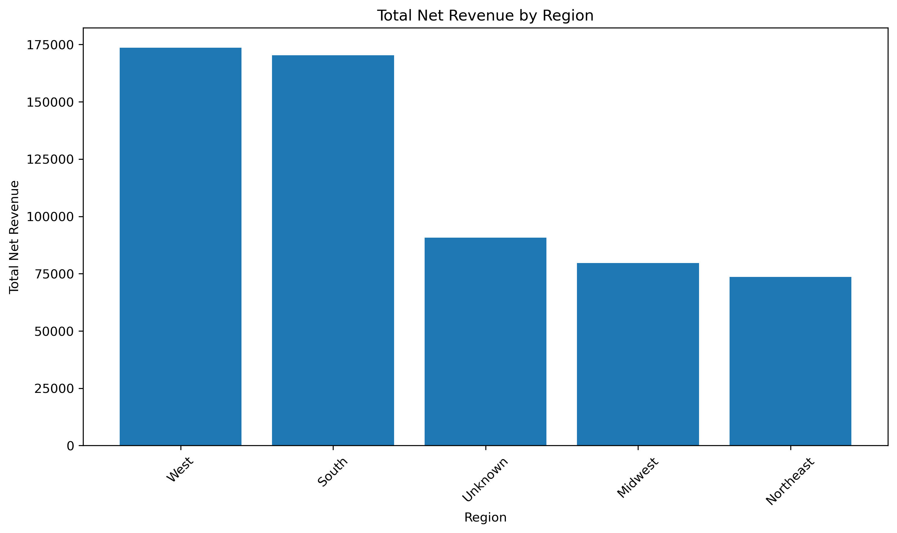
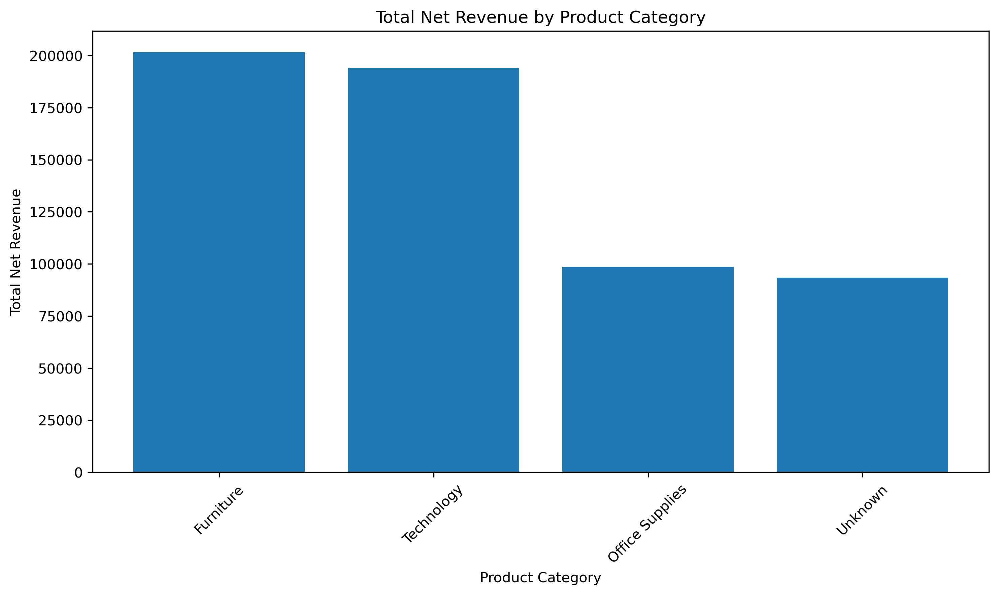

# Python Business Analytics Portfolio

This portfolio showcases Python projects focused on data cleaning, automation, exploratory analysis, forecasting, machine learning, and dashboard ready data preparation.

The goal of this portfolio is to demonstrate how Python can be used to clean messy files, create structured datasets, analyze trends, generate visual insights, and prepare outputs for business intelligence tools like Power BI, Amazon QuickSight, and Excel.

---

## Tools Used

---

## Core Skills Demonstrated

---

## Projects

| Project | Focus | Status |
|---|---|---|
| [Messy Excel Data Cleaning and Reporting Automation](01_Messy_Excel_Data_Cleaning) | Cleaning messy Excel data and creating dashboard ready outputs | Complete |
| [Sales Forecasting and Revenue Trend Analysis](02_Sales_Forecasting) | Forecasting revenue trends with Python | Complete |
| Customer Churn Prediction and Retention Risk Analysis | Predicting customer churn risk with Python | Coming Soon |

---

# Featured Project

## Messy Excel Data Cleaning and Reporting Automation

This project simulates a common business analytics workflow where a messy Excel file is cleaned, standardized, validated, and transformed into dashboard ready reporting outputs.

The project includes messy raw sales order data, automated cleaning logic, data quality checks, summary tables, and visual outputs.

[View Project](01_Messy_Excel_Data_Cleaning)

---

## Portfolio Focus

This Python portfolio complements my Power BI and SQL portfolio work by showing the data preparation and automation layer behind dashboards.

My Python work focuses on:

* Cleaning messy files
* Preparing dashboard ready datasets
* Automating repetitive reporting tasks
* Creating data quality checks
* Summarizing business performance
* Building visual outputs for analysis
* Supporting business intelligence workflows

---

## Related Portfolios

| Portfolio | Link |
|---|---|
| Data Analytics Portfolio | [View Portfolio](https://github.com/ashlynstrickland23/Data_Analytics_Portfolio) |
| Power BI Portfolio | [View Portfolio](https://github.com/ashlynstrickland23/PowerBI_Portfolio) |
| SQL Portfolio | [View Portfolio](https://github.com/ashlynstrickland23/SQL_Portfolio) |
