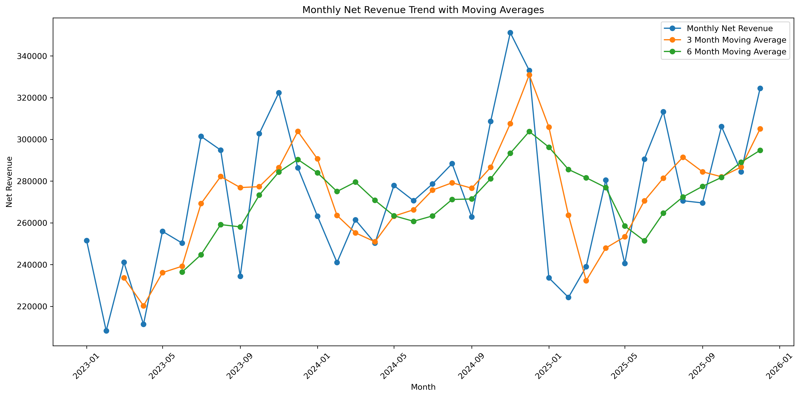
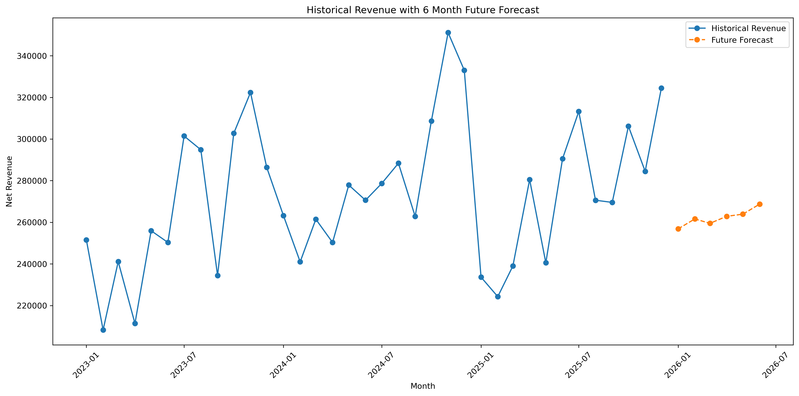
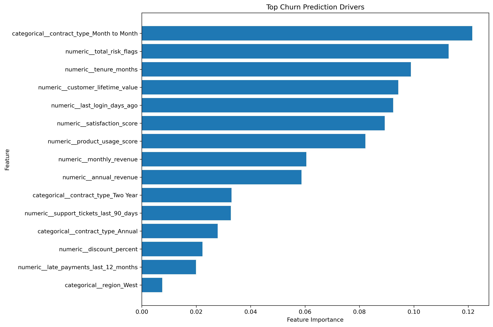
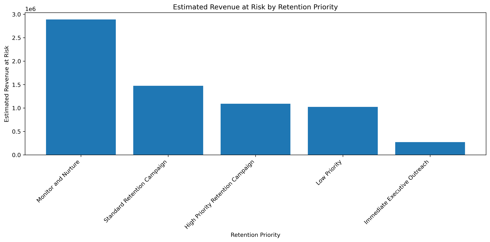

# Python Business Analytics Portfolio

This portfolio showcases Python projects focused on data cleaning, automation, exploratory data analysis, forecasting, machine learning, customer retention analytics, and dashboard ready data preparation.

The goal of this portfolio is to demonstrate how Python can be used to clean messy files, create structured datasets, analyze trends, generate visual insights, build predictive models, and prepare outputs for business intelligence tools like Power BI, Amazon QuickSight, and Excel.

---

## Tools Used

---

## Core Skills Demonstrated

---

## Projects

| Project | Focus | Status |
|---|---|---|
| [Messy Excel Data Cleaning and Reporting Automation](01_Messy_Excel_Data_Cleaning) | Python data cleaning project that transforms a messy Excel sales file into clean, dashboard ready reporting outputs | Complete |
| [Sales Forecasting and Revenue Trend Analysis](02_Sales_Forecasting) | Python forecasting project using 8,574 sales transactions, time series features, moving averages, regression modeling, Random Forest modeling, forecast accuracy metrics, and a six month revenue forecast | Complete |
| [Customer Churn Prediction and Retention Risk Analysis](03_Customer_Churn_Prediction) | Python machine learning project using 10,000 customer records to predict churn, score retention risk, estimate revenue at risk, and create dashboard ready customer success outputs | Complete |

---

# Featured Projects

## Messy Excel Data Cleaning and Reporting Automation

This project simulates a common business analytics workflow where a messy Excel file is cleaned, standardized, validated, and transformed into dashboard ready reporting outputs.

The project includes messy raw sales order data, automated cleaning logic, data quality checks, summary tables, and visual outputs.

[View Project](01_Messy_Excel_Data_Cleaning)

---

## Sales Forecasting and Revenue Trend Analysis

This project uses Python to analyze 8,574 sales transactions across 36 months, create monthly revenue summaries, identify revenue trends and seasonality, compare forecasting models, and generate a six month future revenue forecast.

The project includes time series feature engineering, moving averages, month over month growth, model accuracy metrics, revenue segmentation, and multiple visual outputs.

[View Project](02_Sales_Forecasting)

---

## Customer Churn Prediction and Retention Risk Analysis

This project uses Python and machine learning to predict customer churn, identify high risk customer groups, estimate revenue at risk, and create retention priority outputs.

The project includes 10,000 customer records, churn risk scoring, revenue at risk analysis, retention segmentation, Logistic Regression, Random Forest, Gradient Boosting, model evaluation, confusion matrix analysis, and feature importance reporting.

[View Project](03_Customer_Churn_Prediction)

---

## Portfolio Focus

This Python portfolio complements my Power BI and SQL portfolio work by showing the data preparation, analysis, automation, and predictive modeling layer behind dashboards.

My Python work focuses on:

* Cleaning messy files
* Preparing dashboard ready datasets
* Automating repetitive reporting tasks
* Creating data quality checks
* Summarizing business performance
* Building visual outputs for analysis
* Performing time series trend analysis
* Creating revenue forecasts
* Building machine learning models
* Evaluating model performance
* Identifying customer retention risk
* Estimating revenue at risk
* Supporting business intelligence workflows

---

## Business Problems Covered

| Business Problem | Project Example |
|---|---|
| Messy Excel files need to be cleaned before reporting | [Messy Excel Data Cleaning](01_Messy_Excel_Data_Cleaning) |
| Leaders need clean dashboard ready sales summaries | [Messy Excel Data Cleaning](01_Messy_Excel_Data_Cleaning) |
| Revenue needs to be analyzed over time | [Sales Forecasting](02_Sales_Forecasting) |
| Businesses need to understand seasonality and future sales expectations | [Sales Forecasting](02_Sales_Forecasting) |
| Customer success teams need to identify churn risk | [Customer Churn Prediction](03_Customer_Churn_Prediction) |
| Leaders need to know which customers and revenue are at risk | [Customer Churn Prediction](03_Customer_Churn_Prediction) |

---

## Related Portfolios

| Portfolio | Link |
|---|---|
| Data Analytics Portfolio | [View Portfolio](https://github.com/ashlynstrickland23/Data_Analytics_Portfolio) |
| Power BI Portfolio | [View Portfolio](https://github.com/ashlynstrickland23/PowerBI_Portfolio) |
| SQL Portfolio | [View Portfolio](https://github.com/ashlynstrickland23/SQL_Portfolio) |

---

## Connect

| Platform | Link |
|---|---|
| Website | [Data Driven Dashboards](https://datadrivendashboards.com) |
| LinkedIn | [Ashlyn Strickland](https://www.linkedin.com/in/ashlyn-strickland-67023b363) |
| Contact | [Contact Form](https://datadrivendashboards.com/contact) |
